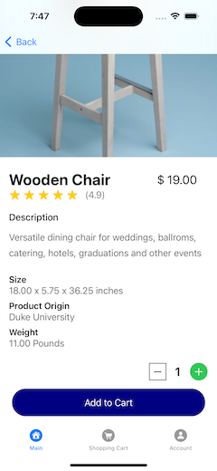

# Gather Green

## Members
Sophia Wang sw572
Xichu Xiao xx92
Yiyang Shao ys378

## Introduction
Are you ready to gather green?
Gather Green App can help you divert through creative waste recovery solutions, thus prevent causing unintended or long- lasting negative impacts on our environment.

## Key Functions
• Product catalog: Displaying a comprehensive list of products available for
purchase.
• Shopping cart: Allowing users to add, remove, and modify items in their cart before
checkout.
• Payment processing: Facilitating secure online payments through ApplePay.
• Order Analysis: Enabling users to review their orders via charts.
• User accounts: Allowing users to create accounts, upgrade their account to premium, save their payment information, and view order history.
• Product search and filtering: Providing search and filtering functionality to help users easily find desired products.
• Message Admin

## Usage

- You are automatically login to the tester account：no need to login, no need to subscibe
- The tester account is already a premuim account. No subscription button will present in subscription page.
- Click product card to view product detail
- In product detail, click add to cart to add product to shopping cart
- In Shopping Cart tab, click checkout to process the payment
- In Account tab, click order history to view your orders
- Explore other buttons

## Sample Pages

## Gather-Green Admin
This is the Admin app for the business to manage the product list, the inventory, and the orders.
Repo address: https://gitlab.oit.duke.edu/sw572/gather_green_admin

## Gather-Green Backend Server
Language: Swift
Web Framework: Vapor
ORM Framework: Fluent
Server Page Templating Language: Leaf (not finished yet)
Database: PostgreSQL

Repo address: https://gitlab.oit.duke.edu/sw572/gathergreenserver
An introduction of the server API is provided with sample HTTPRequst headers, bodys and corresponding HTTPRequest responses.

## Privacy Policy
https://sites.google.com/view/gather-green-privacy-policy
